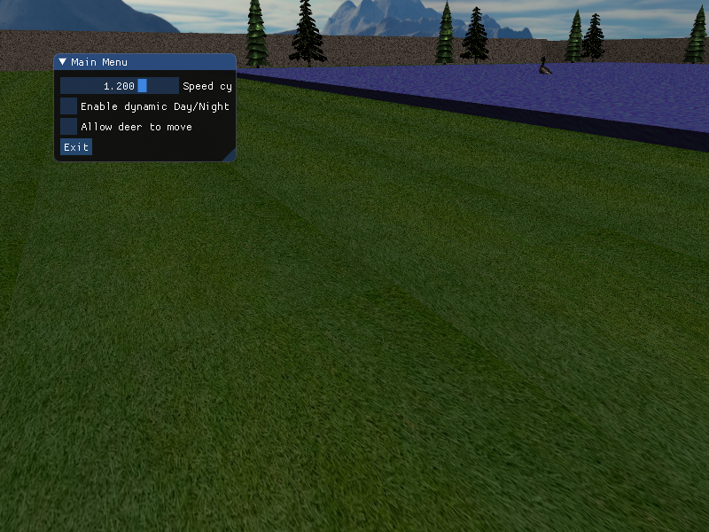

# IMT2531-Exam
Repository for the exam deliverables to IMT2531 - Graphics Programming


## How to setup

Make sure you have [cmake](https://cmake.org/) version 3.14 or later installed.
Navigate to the root folder of the project and execute the following commands

On linux:
```
mkdir build
cd build
cmake ..
make
./Exam
```

On windows:
```
mkdir build
cd build
cmake ..
cmake --build .
cd ..
cd out/build/x64-Debug
Exam.exe
```

## Controls

W - Move player forward

A - Move player left

S - Move player backwards

D - Move player right

T - Switch between first-person, third-person and top down view(bird view)

LShift - Sprint

Esc - Exit the game

Arrow keys - Navigate the menu

Space - Make a selection in the menu

## Features

### Objects that are used:
 * Man(main player)
 * Cube
 * Deer
 * Tree
 * Eagle
 * Duck

 Duck, eagle and deer moves randomly.

 * Instead of heightmaps terrain, it's generated a flat terrain.
 * The scene is illuminated using directional light.
 * Skybox is implemented with clouds.
 * Provide a free-moving camera whose orientation is controlled by the mouse and/or WASD keys.
 * Allow switching between global camera (“bird view”), 3rd person and 1st person perspectives using the toggle button ‘t’.
 * Allow dynamic movement of sunlight to produce day/night cycle.
 * Allow the user to control the speed of day/night cycle using GUI
 * Allow the user to enable/disable dynamic day/night cycle
 * Allow the user to allow or not deer to move
 * Collision detection is implemented for all objects

 Below is a photo that show menu



